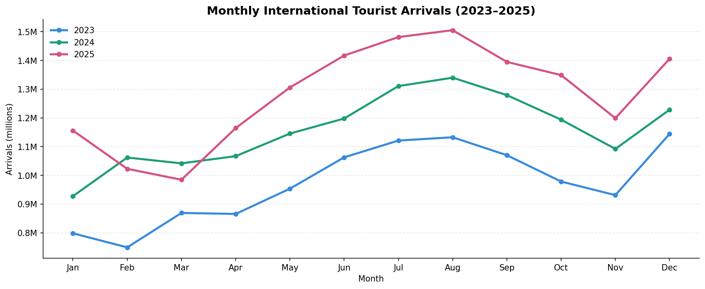
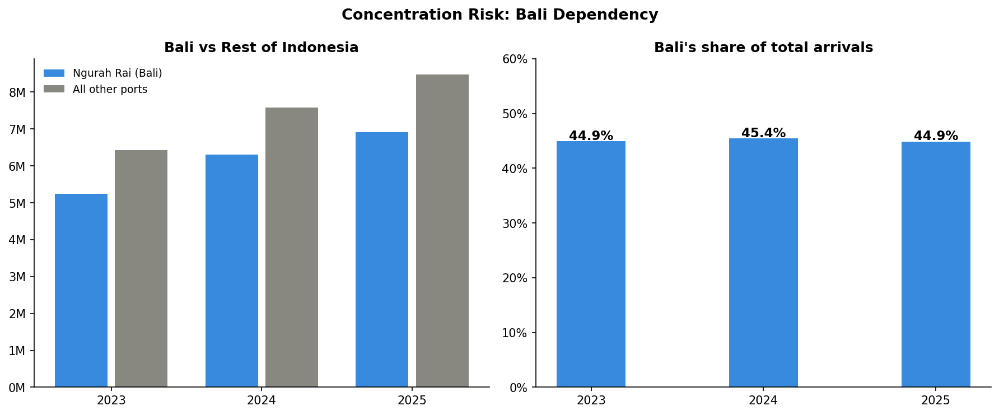
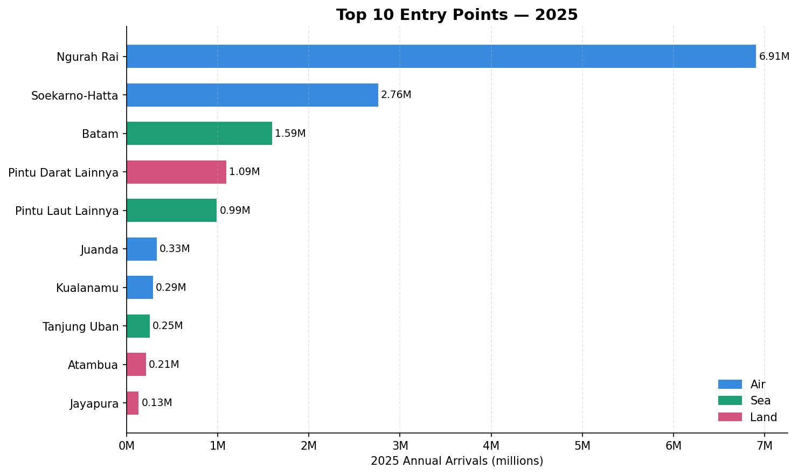
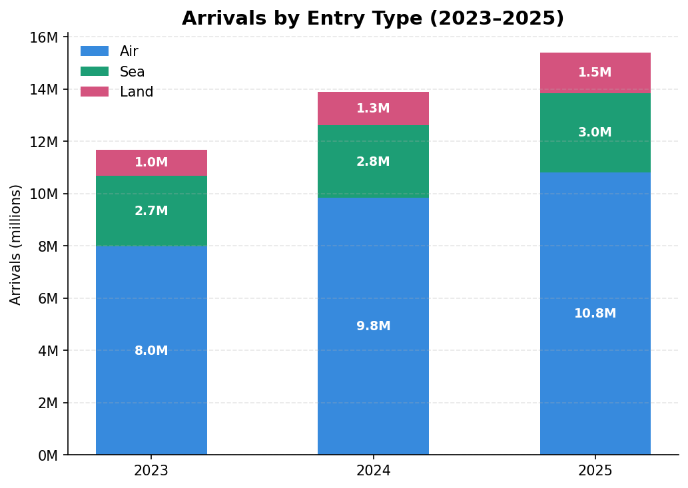

# 🇮🇩 Indonesia International Tourist Arrivals Analysis

**Tools:** Python · Pandas · Matplotlib · Power BI
**Data:** [Badan Pusat Statistik / BPS](https://www.bps.go.id) (Indonesia's official statistics agency)  
**Period:** January 2023 – December 2025

---

## About This Project

This is a data analyst portfolio project analyzing monthly international tourist arrivals to Indonesia across 23 entry points — airports, seaports, and land border crossings.

The analysis covers the full data workflow:

- **Data cleaning** — fixing a messy Excel file from a government website
- **Exploratory Data Analysis (EDA)** — finding trends, patterns, and outliers
- **Visualization** — building charts that answer real business questions
- **Insights** — turning numbers into clear, actionable conclusions

---

## Questions This Project Answers

1. Is Indonesia's international tourism still growing?
2. How dependent is Indonesia on Bali as a single destination?
3. Which entry points are growing the fastest?
4. When is peak tourist season — and how predictable is it?
5. Is air, sea, or land travel growing the fastest?

---

## Dataset

|              |                                                            |
| ------------ | ---------------------------------------------------------- |
| Source       | BPS Statistics Indonesia — publicly available at bps.go.id |
| Coverage     | January 2023 – December 2025 (36 months)                   |
| Entry points | 23 ports — 16 airports, 7 seaports, 6 land borders         |
| Metric       | Monthly foreign tourist arrivals (visitor count)           |
| Format       | Excel (.xlsx) with multi-row merged cell headers           |

### Data Issues Found & Fixed

The raw file from BPS had several problems that needed cleaning before analysis:

| Problem                                     | Fix Applied                               |
| ------------------------------------------- | ----------------------------------------- |
| 3-row merged header (title / year / month)  | Rebuilt column names manually in Python   |
| Section headers mixed into data rows        | Removed subtotal and grand total rows     |
| Dash `-` used instead of 0 for empty months | Replaced with 0                           |
| Missing values (NaN)                        | Filled with 0                             |
| Wide format (one column per month)          | Reshaped to tidy long format for analysis |

---

## Repository Structure

```
indonesia-tourism-analysis/
│
├── indonesia_tourism_analysis.ipynb   ← Main notebook (cleaning + EDA + charts)
├── indonesia_tourism_clean.csv        ← Clean data, ready for Power BI
├── indonesia_tourism_dashboard.pbix   ← Power BI file
├── data/
│   └── Query_Builder_Result_...xlsx    ← Original raw file from BPS
└── visuals/
    ├── chart1_monthly_trend.png
    ├── chart2_entry_type.png
    ├── chart3_top10_ports.png
    ├── chart4_bali_dependency.png
    └── powerbi_dashboard.png
```

---

## How to Run

```bash
# 1. Clone this repository
git clone https://github.com/[your-username]/indonesia-tourism-analysis.git
cd indonesia-tourism-analysis

# 2. Install dependencies
pip install pandas matplotlib openpyxl

# 3. Open the notebook
jupyter notebook indonesia_tourism_analysis.ipynb
```

Run each cell from top to bottom. The notebook will generate all charts automatically.

---

## Key Findings

### 1. Tourism is growing — but slowing down

Indonesia welcomed **15.4 million** foreign tourists in 2025, up from 13.9M in 2024 and 11.7M in 2023. Growth is strong but decelerating: +18.9% in 2023→2024, then +10.8% in 2024→2025. This is typical of post-pandemic recovery maturing over time.



---

### 2. Bali handles ~45% of ALL international arrivals — every single year

Ngurah Rai (Bali) accounted for 44.9% in 2023, 45.4% in 2024, and 44.9% in 2025. The share barely changed across three years. This is a structural concentration risk — any disruption to Bali directly impacts nearly half of Indonesia's entire international tourism.



---

### 3. July and August are always the peak months

Seasonality is very stable and predictable across all three years. July–August consistently run 15–17% above the monthly average, while February–March are the slowest. In 2025, the peak month (August, 1.51M) was 53% higher than the trough (March, 985k).

---

### 4. Land borders are the fastest-growing entry type

Land arrivals grew from 1.0M (2023) → 1.3M (2024) → 1.5M (2025), a two-year increase of +53.7% — far ahead of air (+35.7%) and sea (+12%). The biggest surprise is **Atambua**, the East Timor land border, which grew +60% in 2025 alone and +122% over two years.



---

### 5. Batam is growing faster than Jakarta's international airport

Batam seaport grew +21.1% in 2025 while Soekarno-Hatta (Jakarta) grew only +9.4%. At 1.59M arrivals, Batam now handles more than half the volume of Jakarta's main airport — driven by Singapore proximity and short cross-border trips.



---

## Top 10 Entry Points — 2025

| Port                     | Type    |      2023 |      2024 |      2025 | Growth 24→25 |
| ------------------------ | ------- | --------: | --------: | --------: | :----------: |
| Ngurah Rai (Bali)        | ✈ Air   | 5,248,113 | 6,308,541 | 6,907,585 |    +9.5%     |
| Soekarno-Hatta (Jakarta) | ✈ Air   | 1,953,005 | 2,524,253 | 2,760,838 |    +9.4%     |
| Batam                    | 🚢 Sea  | 1,185,685 | 1,316,219 | 1,593,757 |    +21.1%    |
| Other land borders       | 🚗 Land |   763,705 |   949,556 | 1,091,676 |    +15.0%    |
| Juanda (Surabaya)        | ✈ Air   |   218,458 |   322,045 |   329,945 |    +2.5%     |
| Kualanamu (Medan)        | ✈ Air   |   196,475 |   247,038 |   289,656 |    +17.3%    |
| Tanjung Uban             | 🚢 Sea  |   222,118 |   208,605 |   253,366 |    +21.5%    |
| Atambua                  | 🚗 Land |    96,233 |   133,223 |   213,125 |    +60.0%    |
| Jayapura                 | 🚗 Land |    67,413 |   110,873 |   132,847 |    +19.8%    |
| Tanjung Balai Karimun    | 🚢 Sea  |    58,093 |    75,638 |    96,963 |    +28.2%    |

---

## Skills Demonstrated

| Skill                | Details                                                                                         |
| -------------------- | ----------------------------------------------------------------------------------------------- |
| Data cleaning        | Handled real-world messy government data — merged headers, dashes as zeros, mixed subtotal rows |
| Data reshaping       | Converted wide Excel format to tidy long format suitable for analysis and Power BI              |
| Exploratory analysis | Growth rates, CAGR, seasonality index, concentration analysis, port rankings                    |
| Visualization        | 4 charts with matplotlib — line chart, stacked bar, horizontal bar, grouped bar                 |
| Business insight     | Translated numbers into 5 clear findings with a "so what" conclusion each                       |
| Power BI             | Built an interactive dashboard with KPI cards, slicers, and 4 visuals                           |

---

📁 The Power BI file (`indonesia_tourism_dashboard.pbix`) is included in this repo.
Download and open with Power BI Desktop (free) to explore the dashboard.

---

## Tools & Libraries

```
Python      pandas · matplotlib · openpyxl
Power BI    DAX measures · interactive dashboard
Data        BPS Statistics Indonesia (open government data)
```

---

_Data is publicly available at [bps.go.id](https://www.bps.go.id). All analysis and code is original._
